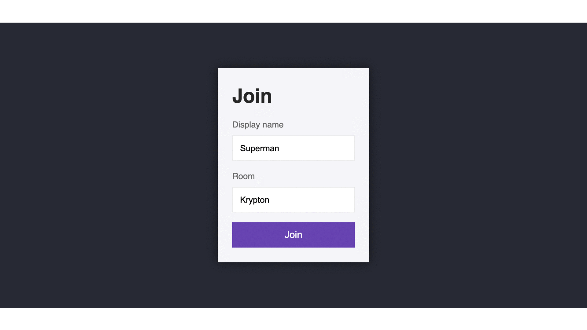

# Chat App using NodeJs and Socket.io

This is a study of Advanced Node.Js programming language.
It uses NodeJs as the programing language, with Socket.io framework.
It is a browser chat app, with chats separated by rooms, without cookies, private and with no message/user tracking after exiting the browser/tab.

---

### Features
- Uses advanced ***JavaScript*** language.
- Uses Node.Js ***npm*** packages.
- Uses ***express*** framework.
- Uses ***socket.io*** as a the chat framework.
- Uses ***mustache*** as frontend template.
- Uses ***moment*** to manipulate and format timestamps.

---

### Test the App

- App is deployed on Heroku for testing:
https://mrbitwise-chat-app.herokuapp.com

---

### Thanks and Credits
The fun of this study was made possible by:
- [Node.js Complete course](https://www.udemy.com/course/the-complete-nodejs-developer-course-2/) in [Udemy](https://www.udemy.com/)
- [Node.js](https://nodejs.org/en/) Official Site
- [npm](https://www.npmjs.com) Official Site
- [Express](https://expressjs.com/) Official Site
- [mongoDB](https://www.mongodb.com/) Official Site
- [Socket.io](https://socket.io/) Official Site
- [Moment](https://momentjs.com/) Official Site
- [Heroku](https://www.heroku.com/) Official Site
- Andrew Mead [GitHub](https://github.com/andrewjmead/node-course-v3-code) Repository and [Site](https://mead.io/)
- All credits from this study goes to *Udemy* and the instructor *Andrew Mead*
